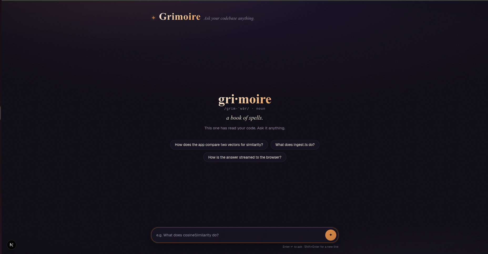
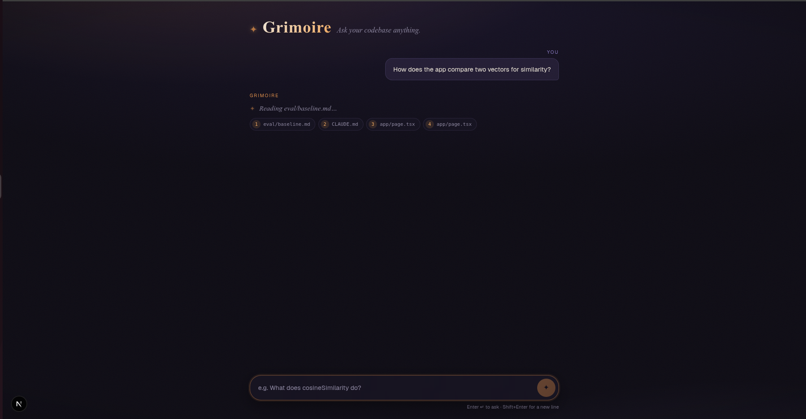
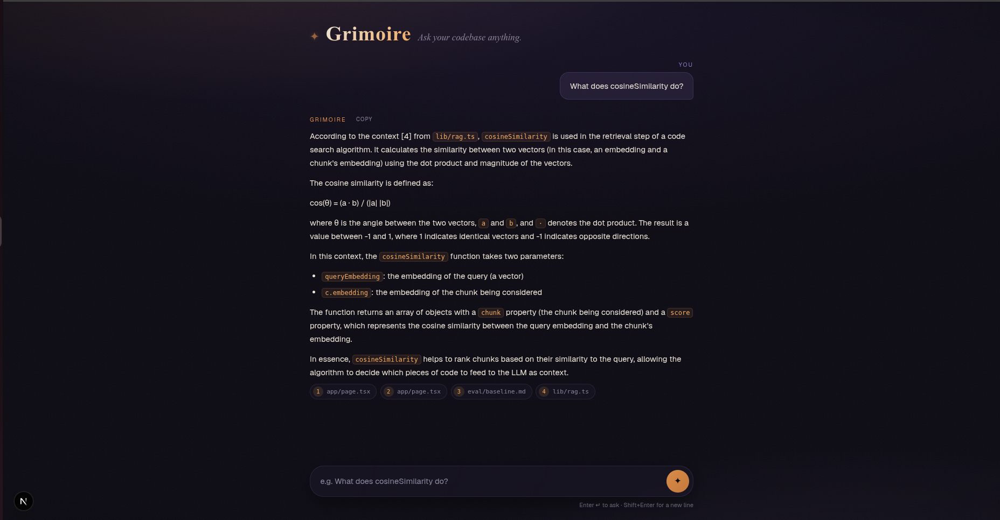

# ✦ Grimoire

> **gri·moire** /ɡrim-ˈwär/ · *noun* — a book of spells. This one has read your code.

Grimoire is a **local-first "chat with your codebase" app**. Point it at any folder of
source code, ask questions in plain English, and get streamed answers grounded in the
actual files — with citations you can see and verify. No cloud, no API keys, no code
leaving your machine: everything runs against a local [Ollama](https://ollama.com)
server, and the entire retrieval core is small, hand-written TypeScript you can read
in one sitting.

## Demo

**Open the tome.** A dictionary, because nobody should have to google the app's name:



**Ask it something.** Loading isn't theater here — each phase shows what the pipeline
is actually doing. Retrieval finishes first, so the source files appear *before* the
model speaks; while the LLM warms up, Grimoire tells you which page it's reading:



**Get a grounded answer.** Markdown-rendered, streamed token by token, with numbered
citations that point at real chips below the answer. Hover a chip for its similarity
score; hover the answer for one-click copy:



And if you ask it how to bake sourdough? *The tome holds no page on that.* When even
the best retrieval match is weak (threshold calibrated against measured score
distributions — see [the eval harness](#measuring-retrieval-quality)), Grimoire
refuses instead of letting a small model improvise.

## How it works

```
 ingest (offline)                        ask (every question)
 ────────────────                        ────────────────────
 read folder                             embed question
   → chunk files (overlapping windows)     → cosine-match against every chunk
   → embed chunks (nomic-embed-text)       → top-4 chunks become the prompt context
   → write data/index.json                 → llama3.2 streams a cited answer
```

The substance lives in [`lib/rag.ts`](lib/rag.ts) — `chunk`, `cosineSimilarity`,
`retrieve` — written by hand, no LangChain, no vector database, no framework. The
"database" is a JSON file. That's the point: every step of RAG, legible end to end.

| Piece | File |
| --- | --- |
| Chunking, similarity, retrieval | `lib/rag.ts` |
| Text → vectors (Ollama `/api/embed`) | `lib/embeddings.ts` |
| Streaming generation (Ollama `/api/chat`) | `lib/ollama.ts` |
| JSON-file vector store | `lib/store.ts` |
| Offline indexer | `scripts/ingest.ts` |
| Retrieval quality eval | `scripts/eval.ts` |
| The one API route: embed → retrieve → prompt → stream | `app/api/chat/route.ts` |
| The chat UI | `app/page.tsx` |

## Quickstart

You need [Ollama](https://ollama.com) running locally with the two models pulled:

```bash
ollama pull nomic-embed-text   # embeddings (768-dim)
ollama pull llama3.2           # generation
```

Then:

```bash
npm install
npx tsx scripts/ingest.ts <path-to-any-codebase>   # build the index (one-off)
npm run dev                                        # open http://localhost:3000
```

Re-run the ingest whenever the indexed code changes — the index is a snapshot.

## Measuring retrieval quality

Grimoire ships its own eval harness: question/expected-file pairs in
[`eval/cases.json`](eval/cases.json) and a runner that reports whether the right file
lands in the top-k retrieved chunks:

```bash
npx tsx scripts/eval.ts
```

It prints per-question ranks, hit@1 / hit@4 / MRR (split into semantic vs. keyword
questions), and a calibration block showing where unanswerable questions score — which
is how the "I don't know" threshold was chosen rather than guessed. Current baseline
lives in [`eval/baseline.md`](eval/baseline.md).

## Roadmap

- **Hybrid search** — BM25-style keyword matching fused with vector similarity, to fix
  the exact-identifier/filename misses pure semantic search makes. The eval harness
  exists precisely to prove this helps, with numbers.
- Incremental re-indexing, smarter chunking, scaling past the linear JSON scan.

---

*Built by hand as a learning project — the best way to understand RAG is to write one.*
